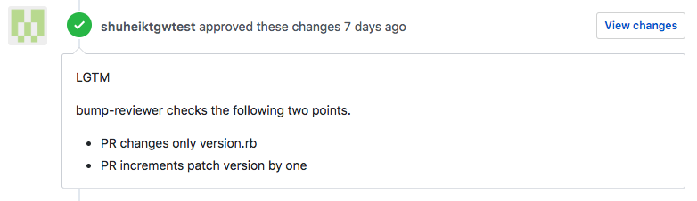
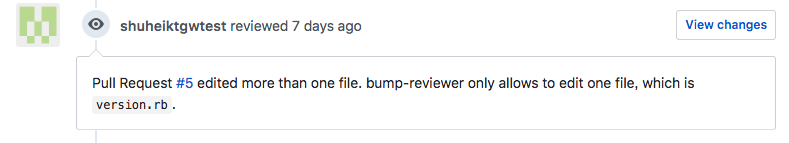

bump-reviewer
====
[](release)
[](https://circleci.com/gh/shuheiktgw/bump-reviewer)
[](LICENSE)

`bump-revewer` is a CLI tool to automatically review your private Ruby Gem's bump up PRs.

## Demo

**Review succeeds**

When review succeeds, bump-reviewer automatically approves your PR. 




**Review fails**

When review fails, bump-reviewer tells you why it failed. There are several possible reasons why it fails.



## Usage

```
bump-reviewer [options...]

OPTIONS:
  --owner value, -o value   specifies GitHub Owner
  --repo value, -r value    specifies GitHub Repository Name
  --token value, -v value   specifies GitHub Personal Access Token
  --number value, -n value  specifies GitHub Pull Request Number to review
  --version, -v             prints the current version
  --help, -h                prints help

```

## GitHub Token
`bump-reviewer` needs a GitHub personal access token with enough permission to create and update your repository. If you are not familiar with the access token, [This GitHub Help page](https://help.github.com/articles/creating-a-personal-access-token-for-the-command-line/) guides you though how to create one.

Please be aware that, for a public repository, you just need `public_repo` scope, and for a private repository, you need whole `repo` scope.


## What bump-reviewer is for
`bump-reviewer` developed to free you from a tedious Ruby Gem's PR reviews, especially ones which just increments `VERSION` constant.

If your organization has a private Ruby Gem, you may require to increment `VERSION` constant in `version.rb` whenever you release the Gem.

`bump-reviewer` automatically reviews and approves those "bump up" PRs. 

## How it reviews PRs
`bump-reviewer` reviews following two points.

- Pull Request changes only `version.rb` file.
- Pull Request increments patch version by one. 

## bump-reviewer and CI
`bump-reviewer` is intended to be used from a CI environment, such as [CircleCI](https://circleci.com/) and [TravisCI](https://travis-ci.org/). Below is a sample configuration of CircleCI with `bump-reviewer`.

```yaml
version: 2
jobs:
  build:
    working_directory: ~/repo
    docker:
      - image: circleci/ruby:latest
        environment:
          RAILS_ENV: test
          TZ: /usr/share/zoneinfo/Asia/Tokyo

    steps:
      - checkout

      - restore_cache:
          keys:
          - v1-dependencies-{{ checksum "Gemfile" }}
          - v1-dependencies-

      - run:
          name: install dependencies
          command: bundle install --path vendor/bundle

      - save_cache:
          paths: ./vendor/bundle
          key: v1-dependencies-{{ checksum "Gemfile" }}

      - run:
          name: run tests
          command: bundle exec rspec

  bumpup:
    docker:
      - image: shuheiktgw/bump-reviewer:latest

    steps:
      - run:
          name: bump up
          command: if github-label-checker -o $CIRCLE_PROJECT_USERNAME -r $CIRCLE_PROJECT_REPONAME -t $GITHUB_TOKEN -n $CIRCLE_PR_NUMBER bumpup; then
                       bump-reviewer -o $CIRCLE_PROJECT_USERNAME -r $CIRCLE_PROJECT_REPONAME -t $GITHUB_TOKEN -n $CIRCLE_PR_NUMBER;
                     else
                       exit 0;
                     fi

workflows:
  version: 2
  build_and_bumpup:
    jobs:
      - build
      - bumpup:
          requires:
            - build
``` 

There are a few points which needs some explanation.

#### 1. `github-label-checker`

`github-label-checker` is another CLI tool I developed to check if the PR has a specified label or not.

Since you are most likely not to want to run `bump-reviewer` against every PR, it is a good practice to check labels before running `bump-reviewer`. 

In the above example, I configured to run `bump-reviewer` only when the PR has a label called `bumpup`

For more information about `github-label-checker`, please visit [shuheiktgw/github-label-checker](https://github.com/shuheiktgw/github-label-checker) 

#### 2. `image: shuheiktgw/bump-reviewer:latest`

I have created pre-built Docker image, [shuheiktgw/bump-reviewer](https://hub.docker.com/r/shuheiktgw/bump-reviewer/), which is installed `bump-reviewer` and `github-label-checker` on top of `ciecleci/golang:latest` image.

Dockerfile for the image is [here](https://github.com/shuheiktgw/bump-reviewer/blob/master/Dockerfile), and it is configured to [rebuild the image every time its dependent libraries are updated](https://github.com/shuheiktgw/bump-reviewer/blob/master/.circleci/config.yml#L14). 


## Author
[Shuhei Kitagawa](https://github.com/shuheiktgw)